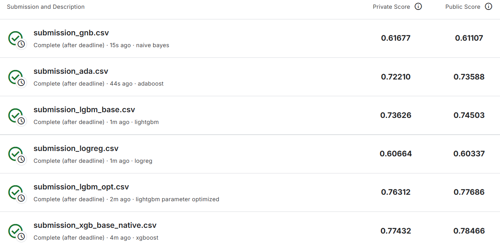
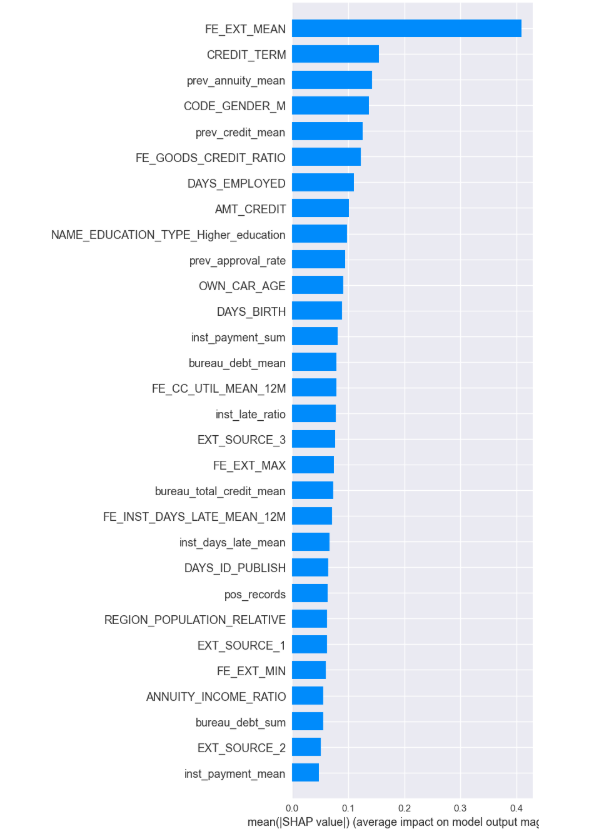
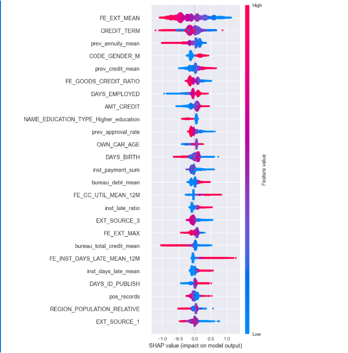
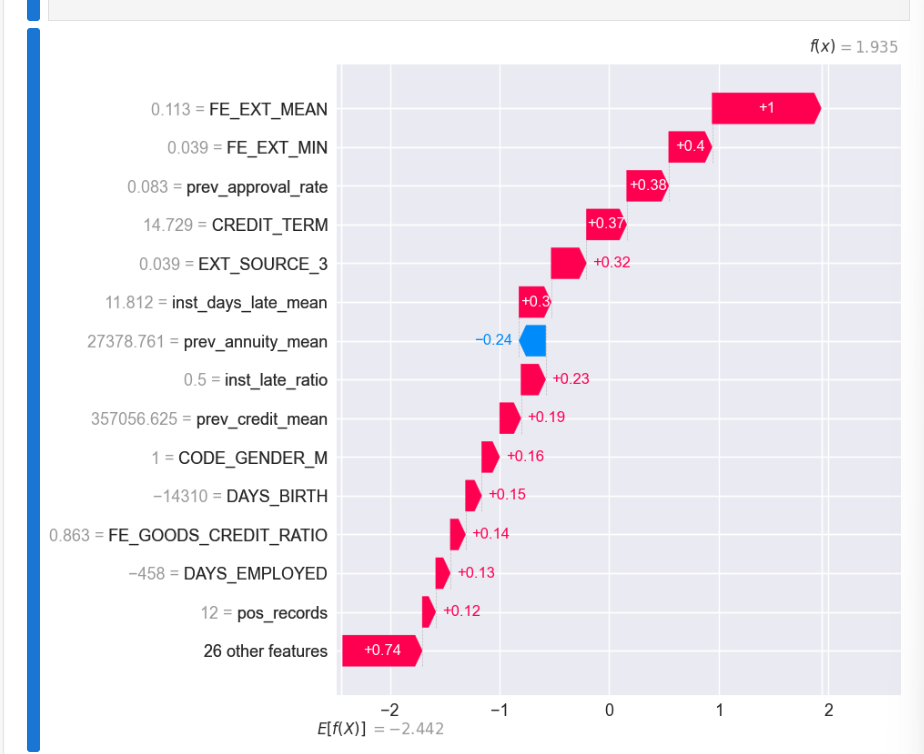

# Interpretable Credit Default Risk Modeling with XGBoost and SHAP

This repository presents an end-to-end machine learning project for **credit default risk prediction** using the *Home Credit Default Risk* dataset from the [Kaggle competition](https://www.kaggle.com/competitions/home-credit-default-risk/). The focus of this work is not only on building a strong predictive model, but also on making the model **transparent, explainable, and business-interpretable**.

---

## Results at a Glance

The table below summarizes model performance across different algorithms and evaluation sets, including **public and private leaderboard scores** from the Kaggle competition. These results demonstrate that the **XGBoost-based model consistently outperforms other candidates** and was selected as the champion.

The chart below visually compares public/private Kaggle ROC-AUC scores across models, reaffirming **XGBoost as the champion**:

---

## Project Objective

The primary aim of this project is to build a robust and explainable credit risk model that:

- Produces accurate predictions of default risk
- Uses strong feature engineering tailored to the Home Credit dataset
- Applies stratified cross-validation for reliable performance estimation
- Provides **global and local interpretability** using SHAP (Shapley Additive Explanations)
- Demonstrates model transparency suitable for business and regulatory requirements

---

## End-to-End Modeling Pipeline

This project follows a systematic machine learning process:

1. **Data Cleaning and Preprocessing**
   - Consistent handling of missing values
   - Encoding categorical variables
   - Feature scaling and alignment

2. **Feature Engineering**
   - Aggregations from historical tables (bureau, installments, previous applications)
   - Custom financial ratios
   - Temporal and behavioral features

3. **Feature Selection**
   - Gain-based feature importance
   - Correlation-based pruning
   - Final compact yet informative set of features

4. **Model Training and Tuning**
   - Evaluation of classical ML models and boosting models
   - Cross-validated performance metrics
   - XGBoost chosen as the final model due to stability and performance

5. **Model Explainability**
   - SHAP analysis for global importance and local interpretation
   - Visualization of feature effects and decision explanations

---

## Champion Model: XGBoost

The final chosen model is an **XGBoost classifier**, which demonstrated strong performance and robust generalization across cross-validation folds. The model was implemented using native XGBoost training APIs with early stopping and effective hyperparameter choices.

Beyond performance, the most valuable aspect of this model is the ability to explain its predictions using SHAP values, allowing both **high-level insight** and **instance-level justification**.

---

## SHAP-Based Explainability

To help stakeholders understand how the model makes decisions, SHAP methodology was applied to analyze both **global behavior** and **individual predictions**.

### Global Feature Importance

The following SHAP summary plot shows the most influential features and their relative importance across the dataset:

This plot indicates that external credit scores, repayment patterns, credit term lengths, and prior credit behavior are among the most impactful predictors.

---

### Directional Effects on Risk

The SHAP beeswarm plot reveals how feature values move predictions toward higher or lower default risk:

High external scores generally reduce risk, while extended credit terms and delayed payments push the predicted risk upward. Feature color gradients further show when high or low feature values contribute to default risk.

---

### Local Explanations

By inspecting SHAP waterfall plots, we can understand the model’s decision for specific individuals:

This means that for a particular customer, we can explain *why* the model classified them as high or low risk, which is essential for auditability and credit committee justification.

---

## Business and Practical Relevance

From a risk management perspective, this model delivers:

- **Transparent risk scores** that can be explained to stakeholders
- **Feature-level insights** that align with financial domain knowledge
- **Local explanations** justifying individual decisions
- Stability across competitive benchmarks (Kaggle public/private scores)

This combination of interpretability and performance makes the solution suitable for operational credit scoring, regulatory documentation, and business-facing reporting.

---

## Key Takeaways

- XGBoost provides robust default prediction performance
- SHAP enhances interpretability from global to individual levels
- The model’s predictions are explainable, auditable, and aligned with domain intuition
- This repository demonstrates a *production-ready* modeling approach that balances accuracy with transparency

---

## Notes

This project leverages the public Home Credit dataset to showcase reproducible machine learning and interpretability techniques. It is intended for educational and demonstration purposes and should be validated thoroughly before use in operational environments.

